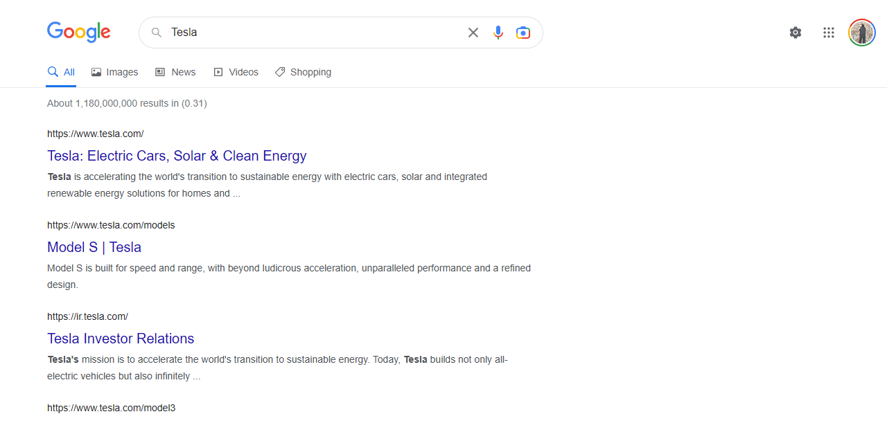

## Google Search built with ReactJS and styled with Tailwind CSS

# Installation Instructions
1. `git clone https://github.com/my-google-search-clone.git`

2. `cd https://github.com/my-google-search`

3. `npm install`

# Frameworks and Tools used in this project
1. React JS
2. Tailwind CSS
3. Axios 
4. React-rounter-dom

